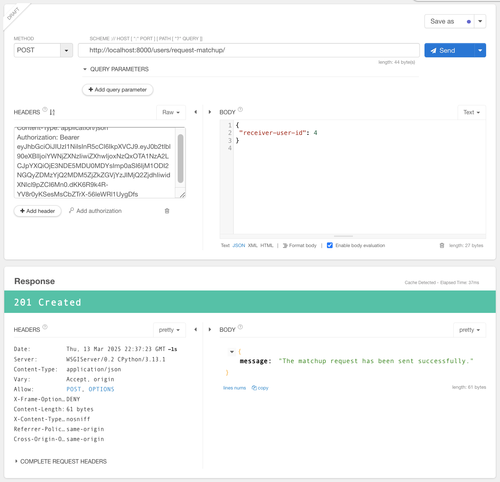
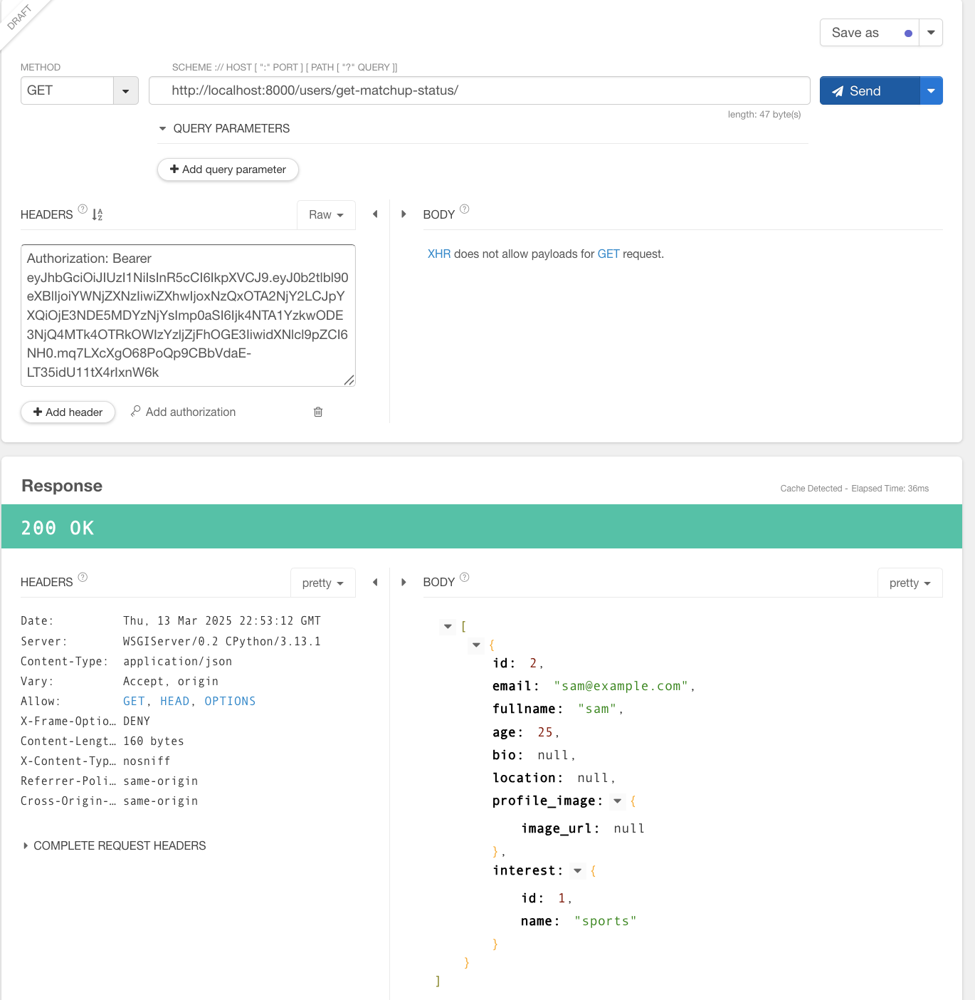
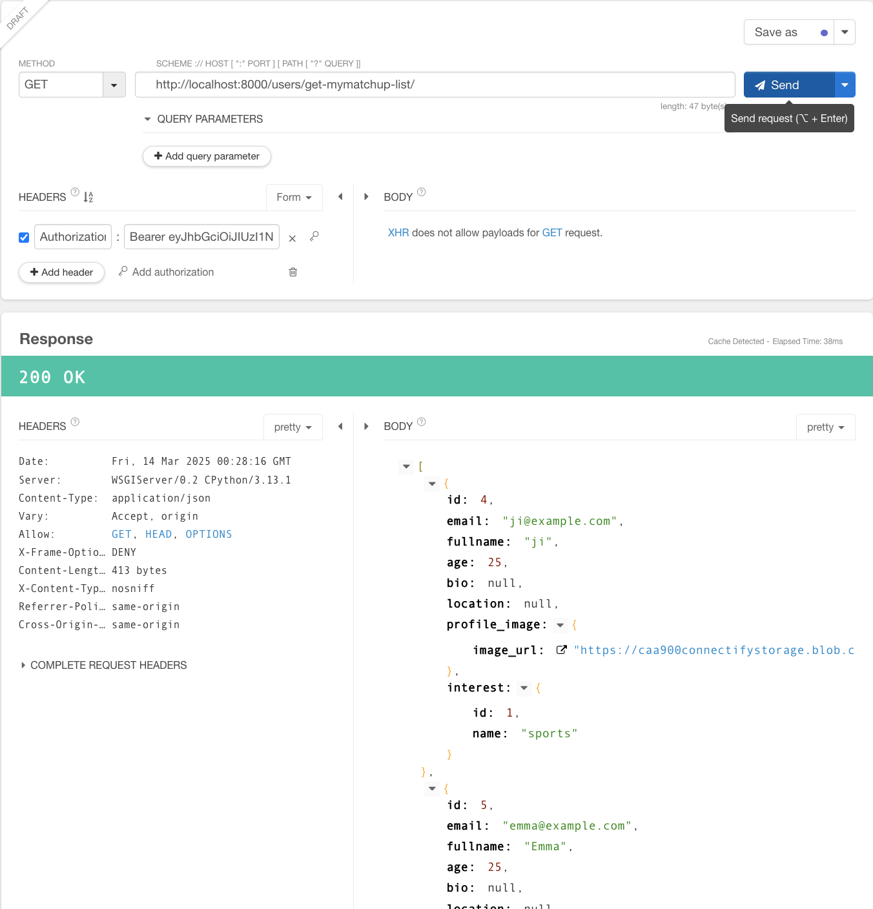
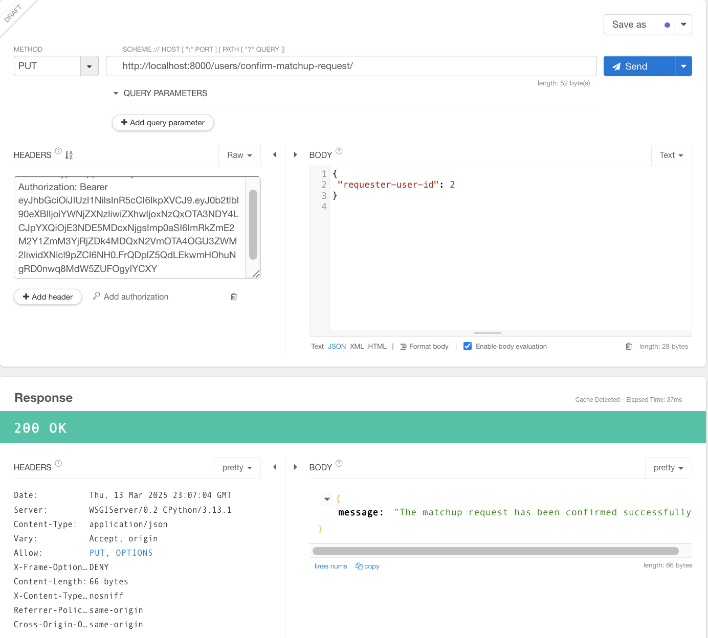
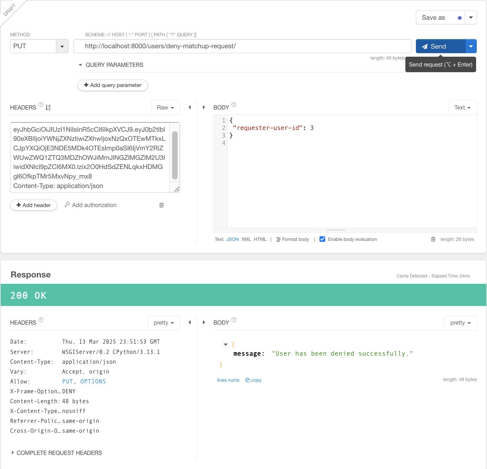
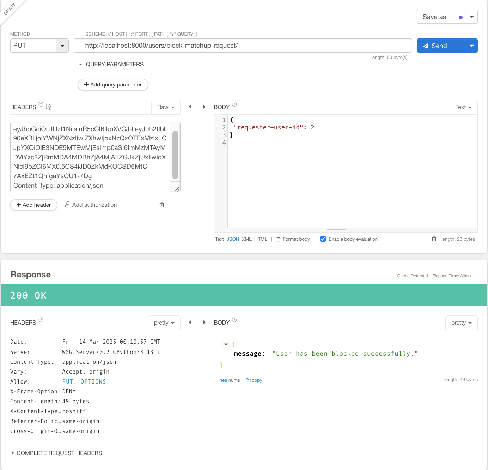
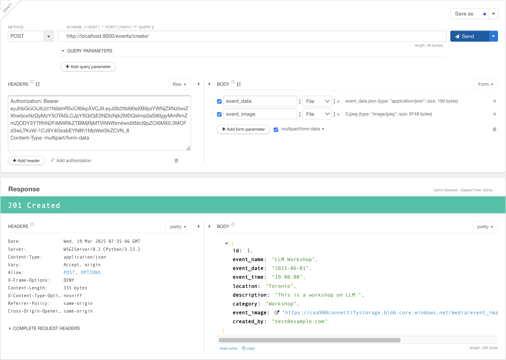
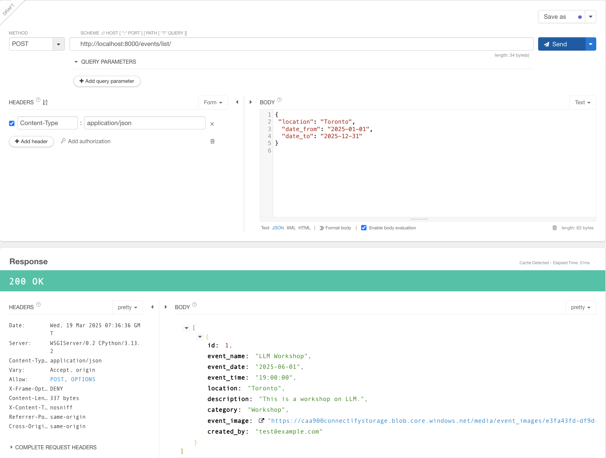

# Endpoints to be implemented

## For matchup request and confirmation


# Docker Compose

0. Replace the <azure_blob_connection_string> in the `.env` file with the connection string of the Azure storage account.

1. Build Django web application image

In the root directory, run
```
 docker build -t connectify-backend-web .
```

2. Start both Django & PostgreSQL containers using Docker Compose

Still in the root directory, run

```
docker-compose up -d --build
```

3. Check running containers

```
docker ps -a
```

4. Apply migrations (optional)

```
docker exec -it <django_app_container_id> python manage.py migrate
```

5. Stop containers

Stop the containers

```
docker-compose down
docker-compose down -v
```


# Connectify Backend - Django + PostgreSQL

## Development Environment Settings

### 1. Django

> **_Note:_** to install `psycopg2`, one of the most popular PostgreSQL adapters for using PostgreSQL in a Django project, the PostgreSQL development libraries (i.e., postgresql) or Python development headers that are needed to compile the C extensions in `psycopg2` is required on the host.

### 2. PostgreSQL

During development phase, run a PostgreSQL container on the host with `.env` and `init.sh` in the database directory.

## Steps to test code in this repo

### 1. Run a PostgreSQL container

Goto the database directory

```cd database```

Check if the `init.sh` file has execute permission, if not

```chmod +x init.sh```

Run docker container

```./init.sh```


### 2. Install all dependencies

Go back to the root directory

```cd ..```

Python virtual environment (some minor differences if you are using Windows)

```
python -m venv .venv 
source .venv/bin/activate
```

Install dependencies

```pip install -r requirements.txt```


### 3. Make migrations, then migrate and insert example data

For development purpose, the .env file is included in the repo. It includes necessary environment variables to ensure code runs smoothly

```
python manage.py makemigrations
python manage.py migrate
python manage.py dbshell < database/migrate_data.sql
```


> **_Note:_** If something wrong when you run `python manage.py makemigrations`, try deleting `0001_initial.py` and run the command again.

> **_Note:_** Please use connection variables in the GitHub secrets to connect to Azure Blob container to test upload/retrieve profile images.

### 4. Run server

```
python manage.py runserver
```

### 5. Test (Using Talend API Tester - Chrome extension)

#### User Account Management

1. User register
   - URL: http://127.0.0.1:8000/users/create/
   - Method: POST
   - Request Header:
     Content-Type: application/json
   - Request Body:
     ```
     {
       "fullname": "test",
       "email": "test@example.com",
       "age": 25,
       "location": "toronto",
       "password": "123456", 
       "confirm_password": "123456"
     }
     ```
    

2. User login
   - URL: http://127.0.0.1:8000/users/login/
   - Method: POST
   - Request Header:
     Content-Type: application/json
   - Request Body:
     ```
     {
       "email": "test@example.com",
       "password": "123456"
     }
     ```
   - Response:
     After successfully logged in, two tokens (refresh token and access token) will be returned in the response body.
    

3. User logout
   - URL: http://127.0.0.1:8000/users/logout/
   - Method: POST
   - Request Header:
     Content-Type: application/json
   - Request Body:
     ```
     {
       "refresh": "<refresh token>"
     }
     ```
   - Reponse:
     The tokens become invalid.
    

4. Get user's detailed info
   - URL: http://127.0.0.1:8000/users/get-user-info/
   - Method: GET
   - Request Header:
     Authorization: Bearer <access token>
   - Response Body: (json file)
     For example:
     ```
      {
        "id": 1,
        "email": "test@example.com",
        "fullname": "test",
        "age": 25,
        "bio": null,
        "location": null,
        "profile_image":{
          "image_url": "https://caa900connectifystorage.blob.core.windows.net/media/profile_images/6dd843ad-742b-4076-9a84-dd28ad14aa81.png"
        },
        "interest":{
          "id": 1,
          "name": "sports"
        }
      }

     ```
    

5. User update
   - URL: http://127.0.0.1:8000/users/update/
   - Method: PATCH
   - Request Header:
     Content-Type: application/json
     Authorization: Bearer <access token>
   - Request Body:
     And fields except for password, for example
     ```
     {
       "bio": "Hello, this is JIYUN",
       "location": "Beijing"
     }
     ```
    

6. User account delete
   - URL: http://127.0.0.1:8000/users/delete/
   - Method: DELETE
   - Request Header:
     Content-Type: application/json
     Authorization: Bearer <access token>
    

7. User change password
   - URL: http://127.0.0.1:8000/users/change-password/
   - Method: PUT
   - Request Header:
     Content-Type: application/json
     Authorization: Bearer <access token>
   - Request Body:
      ```
      {
        "old_password": "123abc",
        "new_password": "123456",
        "confirm_new_password": "123456"
      }
      ```

      > **_Note:_** Don't use too simple password (at least 6 characters) when you call `change_password` API. 

    


#### Profile Image Management

8. Upload profile image
   - URL: http://127.0.0.1:8000/users/upload-profile-image/
   - Method: PUT
   - Request Header:
     Content-Type: multipart/form-data
     Authorization: Bearer <access token>
   - Request Body (Form):
     Name: profile_image
     Type: File
     Choose a file: <the image to upload>
     
     Name: gallery_images
     Type: File
     Choose a file: <the image to upload>
     ......
     Name: gallery_images
     Type: File
     Choose a file: <the image to upload>

   - Response Body: 
     image_url returned in the response body when uploading suceeded.
       

   An example of how to call this API in frontend using javascript code
   ```
    const uploadImages = async (profileImage, galleryImages) => {
        const formData = new FormData();

        formData.append("profile_image", profileImage); // Single profile image

        // Append multiple gallery images
        for (let i = 0; i < galleryImages.length; i++) {
            formData.append("gallery_images", galleryImages[i]); // "gallery_images[]" will be recognized by Django
        }

        try {
            const response = await fetch("http://localhost:8000/api/upload-images/", {
                method: "POST",
                body: formData,
            });
            const result = await response.json();
            console.log(result);
        } catch (error) {
            console.error("Error uploading files:", error);
        }
    };

    // Example usage
    const profileInput = document.querySelector("#profile-input");
    const galleryInput = document.querySelector("#gallery-input");

    document.querySelector("#upload-btn").addEventListener("click", () => {
        uploadImages(profileInput.files[0], galleryInput.files);
    });
   ```
9. Retrieve profile image (URL)
   - URL: http://localhost:8000/users/retrieve-profile-image/
   - Method: GET
   - Request Header:
     Authorization: Bearer <access token>
   - Response Body: 
     name of profile image and a list of names of gallery images returned in the response body when uploading suceeded.
    

#### User interest selecting

10. Interest list (for frontend dropdown list)
   - URL: http://localhost:8000/users/get-interest-list/
   - Method: GET
   - No headers (no credential required)
   - Response Body: 
     A list of key:value pairs, such as:
     ```
      [
      {
      "value": "sports",
      "label": "Sports"
      },
      {
      "value": "music",
      "label": "Music"
      },
      {
      "value": "tech",
      "label": "Technology"
      },
      {
      "value": "art",
      "label": "Art"
      },
      {
      "value": "travel",
      "label": "Travel"
      }
      ]
     ```
    

11. (Users) Interest select
   - URL: http://localhost:8000/users/update-interest/
   - Method: POST
   - Request Header:
     Content-Type: application/json
     Authorization: Bearer <access token>
   - Request Body:
     ```
     {
       "interest": "<user's interest>"
     }
     ```
   - Response Body:
     Interest ID and name, for example:
     ```
     {
        id": 1,
        "name": "sports"     
     }
     ```
    

12. Get user's interest
   - URL: http://localhost:8000/users/retrieve-interest/
   - Method: GET
   - Request Header:
     Content-Type: application/json
     Authorization: Bearer <access token>
   - Response Body: 
     Interest ID and name, for example:
     ```
     {
        id": 2,
        "name": "travel"     
     }
     ```
    

13. Get a list of users (suggested matchups) having the same interest with the specific user
   - URL: http://localhost:8000/users/get-recommend-matchups/
   - Method: POST
   - Request Header:
     Content-Type: application/json
     Authorization: Bearer <access token>
   - Request Body:
     ```
     {
       "interest": "<an interest>"
     }
     ```
   - Response Body: 
     The list of users with the same interest. For example:
     ```
      [
        {
          "id": 4,
          "email": "eni@example.com",
          "fullname": "eni",
          "age": 25,
          "bio": null,
          "location": null,
          "profile_image":{
            "image_url": null
          },
          "interest":{
            "id": 2,
            "name": "travel"
          }
        },
        {
          "id": 5,
          "email": "zara@example.com",
          "fullname": "zara",
          "age": 25,
          "bio": null,
          "location": null,
          "profile_image":{
            "image_url": null
          },
          "interest":{
            "id": 2,
            "name": "travel"
          }
        }
      ]
     ```

    


#### For matchup request and confirmation

> **_Note:_** There are six different matching-up statuses:

  ```
  0 - not-started (No matchup requests started from any side)
  1 - requested (The requester has sent matchup request and is waiting for confirmation from the receiver)
  2 - pending (The receiver received the matchup request but has not confirmed it yet)
  3 - confirmed (The receiver confirmed the matchup request)
  4 - denied (The receiver denied the matchup request)
  5 - blocked (The receiver blocked the matchup request)
  ```

14. Request matchup API 

    Use case: Used for a user (requester) sending matchup request to another user (receiver, with their user_id). 
    
    For example: Ji and Eni have same interest, and Ji wants to make friend with Eni. Ji will log into her account, and find Eni from the suggested matchups. Then she will click the "Make friend" button (or other button names) and send the request to Eni.

   - URL: http://localhost:8000/users/request-matchup/
   - Method: POST
   - Request Header:
     Content-Type: application/json
     Authorization: Bearer <access token>
   - Request Body: 
     ```
      {
        "receiver-user-id": "<user-id>",
      }
     ```
   - Response Body: 
     - "message: the matchup request has already been sent successfully." with HTTP_200_OK if the matchup status is not-started (0)
     - "message: the matchup request has already been sent and please wait for confirmation from the receiver." with HTTP_400_BAD_REQUEST if the matchup status is requested (1)
     - "message: the user sent you a matchup request, please confirm it." with HTTP_400_BAD_REQUEST if the matchup status is pending (2)
     - "message: you are already friends." with HTTP_400_BAD_REQUEST if the matchup status is confirmed (3)
     - "message: Sorry, the receiver doen't want to be your friend." with HTTP_400_BAD_REQUEST if the matchup status is confirmed (4)

    


15. Get matchup status API 

    Use case: Used for the users to get who have sent matchup requests to them. 
    
    For example: Ji already sent a request to Eni and Eni logged into her account, call this API to get the list of users (including Ji) who sent matchup requests to Eni.

   - URL: http://localhost:8000/users/get-matchup-status/
   - Method: GET
   - Request Header:
     Authorization: Bearer <access token>
   - Request Body: empty
   - Response Body: 
     A list of users with the request status "pending", example
     ```
      [
        {
          "id": 4,
          "email": "eni@example.com",
          "fullname": "eni",
          "age": 25,
          "bio": null,
          "location": null,
          "profile_image":{
            "image_url": null
          },
          "interest":{
            "id": 2,
            "name": "travel"
          }
        },
        {
          "id": 5,
          "email": "zara@example.com",
          "fullname": "zara",
          "age": 25,
          "bio": null,
          "location": null,
          "profile_image":{
            "image_url": null
          },
          "interest":{
            "id": 2,
            "name": "travel"
          }
        }
      ]
     ```

    


16. Get the list of my matchups API
    User case: for all users to show who have already became friends of the user.

    For example: Ji logged into her account, and wants to get the list of all her friends

   - URL: http://localhost:8000/users/get-mymatchup-list/
   - Method: GET
   - Request Header:
     Authorization: Bearer <access token>
   - Request Header: empty
   - Response Body: 
     A list of users who are my matchups, example:
     ```
      [
        {
          "id": 4,
          "email": "eni@example.com",
          "fullname": "eni",
          "age": 25,
          "bio": null,
          "location": null,
          "profile_image":{
            "image_url": null
          },
          "interest":{
            "id": 2,
            "name": "travel"
          }
        },
        {
          "id": 5,
          "email": "zara@example.com",
          "fullname": "zara",
          "age": 25,
          "bio": null,
          "location": null,
          "profile_image":{
            "image_url": null
          },
          "interest":{
            "id": 2,
            "name": "travel"
          }
        }
      ]
     ```

    


17. Confirm matchup request API 
    Use case: Used for the receivers to confirm matchup requests sent to them and make friends with the requesters.

    For example: Eni found Ji want to be her friend and she also wants to be Ji's friend. In the status that Eni has logged into her account, she clicks the "Confirmation" button under Ji's profile info. Both of Eni and Ji become friends to each other.

   - URL: http://localhost:8000/users/confirm-matchup-request/
   - Method: PUT
   - Request Header:
     Content-Type: application/json
     Authorization: Bearer <access token>
   - Request Body: 
     ```
      {
        "requester-user-id": "<user-id>",
      }
     ```
   - Response Body: 
     - "message: the matchup request has been confirmed successfully." with HTTP_200_OK.
     - HTTP_400_BAD_REQUEST

    


18. Deny matchup request API 
    Use case: used for the receiver to deny a requester's matchup request (invalid once, users may send matchup requests in the future)

    For example: Ji sent a matchup request to Eni and Eni doesn't want to be friend with Ji. Eni may deny this request, but later she can send matchup to Ji or vice versa.

   - URL: http://localhost:8000/users/deny-matchup-request/
   - Method: PUT
   - Request Header:
     Content-Type: application/json
     Authorization: Bearer <access token>
   - Request Body: 
     ```
      {
        "requester-user-id": "<user-id>",
      }
     ```
   - Response Body: 
     - "message: the matchup request has been denied successfully." with HTTP_200_OK.
     - HTTP_400_BAD_REQUEST

    


19. Block matchup request API 
    Use case: Not accepts any matchup request this time and block any matchup requests in the future, and end friendships for friends.

   - URL: http://localhost:8000/users/block-matchup-request/
   - Method: PUT
   - Request Header:
     Content-Type: application/json
     Authorization: Bearer <access token>
   - Request Body: 
     ```
      {
        "requester-user-id": "<user-id>",
      }
     ```
   - Response Body: 
     - "message: the matchup request has been blocked successfully." with HTTP_200_OK.
     - HTTP_400_BAD_REQUEST

    


#### For events management

20. Create event API 
    Use case: Create events with event name (title), event date, event time, location, description, category, allowing users who creates the event to upload an image (only one image supported now) for the event.
    - A user must log into their account before create an event

   - URL: http://localhost:8000/events/create/
   - Method: POST
   - Request Header:
     Content-Type: application/json
     Content-Type: multipart/form-data
     Authorization: Bearer <access token>
   - Request Body: 
     Name: event_data
     Type: File
     Choose a file: a JSON file with information of the event, for example
     ```
      {
        "event_name": "LLM Workshop",
        "event_date": "2025-06-01",
        "event_time": "19:00",
        "location": "Toronto",
        "description": "This is a workshop on LLM.",
        "category": "Workshop"
      }
     ```
     
     Name: event_image
     Type: File
     Choose a file: <the image to upload>
   
   - Response Body: 
     - "message: the event has been created successfully." with HTTP_200_OK.
     - HTTP_400_BAD_REQUEST

    


     Content-Type: multipart/form-data
     Authorization: Bearer <access token>
   - Request Body (Form):
     Name: profile_image
     Type: File
     Choose a file: <the image to upload>


21. List events (filtered by location and date) API 
    Use case: List all events filtered according to conditions such as location, dates between date_from and date_to.

   - URL: http://localhost:8000/events/list/
   - Method: POST
   - Request Header:
     Content-Type: application/json
   - Request Body: 
     ```
      {
        "location": "<location>",
        "date_from": "<date_from>"
        "date_to": "<date_to>"
      }
     ```
   - Response Body: 
     ```
     [

     ]
     ```

    


